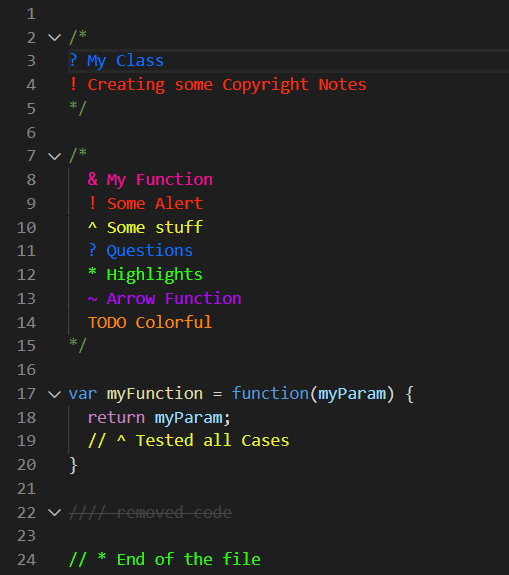

# Colorful Comments

The Colorful Comments Extension will help you create more human-friendly comments in your code.  
With this Extension, you will be able to categorise your cody by special colour into:
* Red (!)
* Blue (?)
* Green (*)
* Yellow (^)
* Pink (&)
* Purple (~)
* Mustard (todo)
* Grey (//)
* Commented out Code can also be Styled to make it Clear the Code shouldn't be There.
* Any Other Comment Styles you'd like can be Specified in the Settings.



## Configurations

This extension can be configured in User Settings or Workspace settings.


`"colorful-comments.multilineComments": true`  
 This setting will control whether multiline comments are styled using the annotation tags.
 When false, multiline comments will be presented without decoration.

`"colorful-comments.highlightPlainText": false`  
This setting will control whether comments in a plain text file are styled using the annotation tags.
When true, the tags (defaults: `! * ? // ~ & ^`) will be detected if they're the first character on a line.

`colorful-comments.tags`  
The tags are the characters or sequences used to mark a comment for decoration.
The default 7 can be modifed to change the colors, and more can be added.

```json
"colorful-comments.tags": [
  {
    "tag": "!",
    "color": "#FF2D00",
    "strikethrough": false,
    "backgroundColor": "transparent",
    "bold": false,
    "italic": false
  },
  {
    "tag": "?",
    "color": "#0076FF",
    "strikethrough": false,
    "backgroundColor": "transparent",
    "bold": false,
    "italic": false
  },
  {
    "tag": "//",
    "color": "#474747",
    "strikethrough": true,
    "backgroundColor": "transparent",
    "bold": false,
    "italic": false
  },
  {
    "tag": "^",
    "color": "#EAF622",
    "strikethrough": false,
    "backgroundColor": "transparent",
    "bold": false,
    "italic": false
  },
  {
    "tag": "*",
    "color": "#28FF00",
    "strikethrough": false,
    "backgroundColor": "transparent",
    "bold": false,
    "italic": false
  },
  {
    "tag": "&", 
    "color": "#FF06A0",
    "strikethrough": false,
    "backgroundColor": "transparent",
    "bold": false,
    "italic": false
  },
  {
    "tag": "~",
    "color": "#BE00FF",
    "strikethrough": false,
    "backgroundColor": "transparent",
    "bold": false,
    "italic": false
  },
  {
    "tag": "todo",
    "color": "#FF8C00",
    "strikethrough": false,
    "backgroundColor": "transparent",
    "bold": false,
    "italic": false
  }
]
```

## Supported Languages 

* C
* C#
* C++
* Clojure
* CSS
* Dart
* Dockerfile
* Groovy
* HTML
* Java
* Javascript
* JavaScript React
* JSON with comments
* Less
* Lua
* Markdown
* Objective-C
* Objective-C++
* PHP
* PowerShell
* Python
* Sass
* SCSS
* TypeScript
* TypeScript React
* YAML

<!-- ## Supported Languages

* Ada
* AL
* Apex
* AsciiDoc
* C
* C#
* C++
* ColdFusion
* Clojure
* COBOL
* CoffeeScript
* CSS
* Dart
* Dockerfile
* Elixir
* Elm
* Erlang
* F#
* Fortran
* gdscript
* GenStat
* Go
* GraphQL
* Groovy
* Haskell
* Haxe
* HiveQL
* HTML
* Java
* JavaScript
* JavaScript React
* JSON with comments
* Julia
* Kotlin
* LaTex (inlc. Bibtex/Biblatex)
* Less
* Lisp
* Lua
* Makefile
* Markdown
* Nim
* MATLAB
* Objective-C
* Objective-C++
* Pascal
* Perl
* Perl 6
* PHP
* Pig
* PlantUML
* PL/SQL
* PowerShell
* Puppet
* Python
* R
* Racket
* Ruby
* Rust
* SAS
* Sass
* Scala
* SCSS
* ShaderLab
* ShellScript
* SQL
* STATA
* Stylus
* Swift
* Tcl
* Terraform
* Twig
* TypeScript
* TypeScript React
* Verilog
* Visual Basic
* Vue.js
* YAML -->
